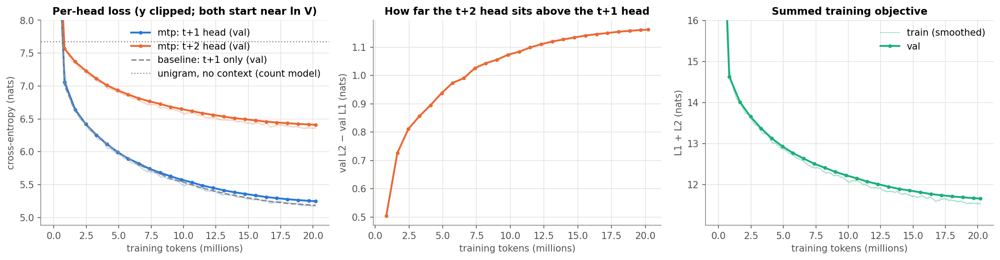
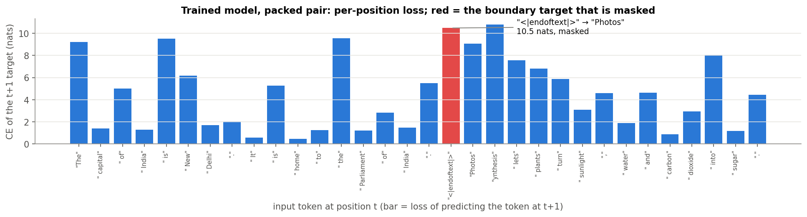
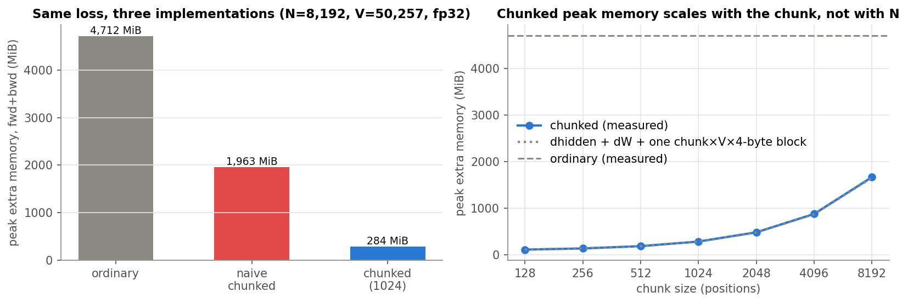
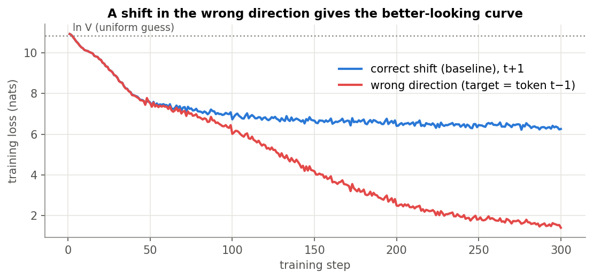

# A loss harness you can read, plus a t+2 head

Built as ERA V5 Session 9 assignment.

Everything is in one notebook, [`loss_harness.ipynb`](loss_harness.ipynb), executed top to bottom
on a Modal T4 with its outputs saved. It takes the textbook four-line loss

```python
hidden = model(tokens)
logits = output_head(hidden)
loss = cross_entropy(logits[:, :-1].reshape(-1, vocab_size), tokens[:, 1:].reshape(-1))
```

and makes each step between `hidden` and the scalar visible. Each step also gets a check that would fail if it were
wrong. The model is a 6-layer GPT (d = 384, RMSNorm, pre-norm, SwiGLU, tied head) with the GPT-2 tokenizer
(V = 50,257): 30,018,816 parameters, trained on 20.2M tokens of FineWeb-Edu.

## Results

### Part 1: the seven numbers

| # | Requirement | Result |
|---|---|---|
| 1 | Print every tensor shape | `logits` is `[32, 256, 50257]` = [B, T, V]; the loss sees `[8160, 50257]` logits against `[8160]` targets ([table](#1-tensor-shapes)) |
| 2 | Verify the shift with strings | decoded inputs beside targets ([table](#2-the-shift-as-strings)); 5/5 programmatic checks pass, two of which are negative controls that must reject wrong-direction and no-shift targets |
| 3 | Mask padding, count changes | contributing positions **68 → 33**; masked mean equals the no-padding reference to 4e-07 |
| 4 | Pack two documents, mask the boundary | packed pair, trained model: **4.578 → 4.387** nats; the one masked target `"<\|endoftext\|>" → "Photos"` costs 10.48 nats |
| 5 | Perplexity of the untrained model | loss **10.921** (ln V = 10.825), perplexity **55,354** = 1.10 × V |
| 6 | Tied vs untied head parameters | **30,018,816 vs 49,317,504** (+19,298,688 = V × D) |
| 7 | Peak memory, ordinary vs chunked CE | **4,712 MiB vs 284 MiB, 16.6×** (fp32, N = 8,192 positions, chunk 1,024); loss 10.909390 vs 10.909389 |

### Part 2: the t+2 head

| | validation loss (nats) | perplexity |
|---|---:|---:|
| t+1 head (`mtp` run) | **5.249** | 190 |
| t+2 head (`mtp` run) | **6.412** | 609 |
| sum L1 + L2 (the training objective) | **11.661** | |
| t+1 head of the `baseline` run (no t+2 head) | 5.187 | 179 |



The t+2 head starts level with the t+1 head at ln V and sits above it from then on. The gap widens over the
whole run, from 0.50 nats at step 100 to 1.16 at the end. Both heads first learn token frequencies,
which help both targets equally. After that the t+1 head gets much more out of context, because the single most
useful piece of context for token t+2 is token t+1, which the t+2 head never sees. A count model with no
network shows the same thing: a bigram scores 6.05 nats, a skip-bigram (predict t+2 from t) scores
7.22. Training the extra head also cost the ordinary head 0.063 nats compared with training t+1 alone. Details in
[Part 2](#part-2-in-detail).

## What was built

* **Data.** The first 19,968 documents of the FineWeb-Edu `sample-10BT` stream, tokenized with GPT-2 BPE,
  each ended with `<|endoftext|>`, packed into 256-token windows. The first ~0.5M tokens of documents are held out for
  validation. A `doc_ids` array records the document of every position, and it is how the masks find the boundaries.
* **Model.** nanoGPT-shaped: residual stream, pre-norm RMSNorm, causal attention,
  SwiGLU FFN (width 1,024 = 8/3 · 384), final RMSNorm, output head tied to the token embedding. When `doc_ids` is
  given, attention is document-aware (causal AND same document) and position ids restart per document, so the
  attention mask and the loss mask agree.
* **Harness.** One function builds every target: `build_targets(tokens, k, valid, doc_ids)` returns the token at
  `t+k`, or `-100` when `t+k` is outside the window, either position is padding, or the two positions are in
  different documents. `masked_ce` divides by the number of contributing positions and returns that count.
  `check_alignment` verifies that every contributing target is the token exactly `k` later. The training loop uses
  these same functions and runs the alignment check on its first batch before any update.
* **Runs.** `baseline` (t+1 only), `mtp` (t+1 and t+2, loss L1 + L2) and a deliberately broken `wrong_shift` control.
  All start from identical weights (asserted) and see the same data order. One pass over
  20.2M tokens; AdamW, warmup then cosine 1e-3 → 1e-4, fp16 autocast.

## Part 1 in detail

### 1. Tensor shapes

The notebook walks one real batch through the model by hand and checks that the manual path reproduces
`model.forward` exactly. Selected rows (full table in notebook §1.1):

| tensor | shape | dimensions |
|---|---|---|
| `tokens` | `[32, 256]` | B = 32 windows, T = 256 positions (token ids) |
| `hidden = norm_f(x) after 6 blocks` | `[32, 256, 384]` | one D = 384 vector per position, what the head reads |
| `output head weight W` | `[50257, 384]` | one row per vocabulary token (V = 50,257); tied to the input embedding |
| `logits = hidden @ W.T` | `[32, 256, 50257]` | a raw score for every vocabulary token at every position |
| `logits[:, :-1].reshape(-1, V)` | `[8160, 50257]` | B·(T−1) predictions; the last position has no next token in the window |
| `tokens[:, 1:].reshape(-1)` | `[8160]` | the B·(T−1) correct next tokens |
| `harness targets build_targets(k=1)` | `[32, 256]` | token at t+1, or −100 where the prediction is not legitimate |
| `per-position cross-entropy` | `[32, 256]` | −log p(correct next token), 0 where ignored |
| `loss` | `[]` | scalar: sum over contributing positions ÷ their count |

### 2. The shift as strings

Inputs beside targets, decoded with the real tokenizer. These are the targets `build_targets` produces, and the
training loop uses the same function:

| input token t | t+1 target | t+2 target |
|---|---|---|
| `"The"` | `" capital"` | `" of"` |
| `" capital"` | `" of"` | `" India"` |
| `" of"` | `" India"` | `" is"` |
| `" India"` | `" is"` | `" New"` |
| `" is"` | `" New"` | `" Delhi"` |
| `" New"` | `" Delhi"` | `","` |
| `" Delhi"` | `","` | `" and"` |
| `","` | `" and"` | `" the"` |
| `" and"` | `" the"` | `" Parliament"` |
| `" the"` | `" Parliament"` | `" meets"` |
| `" Parliament"` | `" meets"` | `" there"` |
| `" meets"` | `" there"` | `"."` |
| `" there"` | `"."` | *(masked: end of window)* |
| `"."` | *(masked: end of window)* | *(masked: end of window)* |

Programmatic checks on the final code: every contributing target in a full validation batch (with document
boundaries) is the token one position later, and with nothing to mask the harness loss equals the literal four-line
slicing formula (literal 10.909299 vs harness 10.909300; denominators 8,160 vs 8,160). A check that cannot fail
proves nothing, so the same check is run on wrong-direction and no-shift targets:
*check correctly FAILED: 8,092 of 8,153 targets are NOT the token 1 position(s) later (32 of them point outside the window)*.

### 3. Padding

Four sentences right-padded into a `[4, L]` batch. GPT-2 has no pad token, so the filler is `<|endoftext|>`, and the
mask comes from the lengths, never from the id.

| | untrained | trained |
|---|---:|---:|
| positions B·(L−1) | 68 | 68 |
| contributing after mask | 33 | 33 |
| loss, unmasked | 10.242 | 7.955 |
| loss, masked but divided by B·(L−1) | 5.263 | 2.499 |
| **loss, masked (correct)** | **10.845** | **5.149** |
| each sentence run alone, no padding | 10.845 | 5.149 |

The masked mean reproduces the no-padding reference. The wrong denominator roughly halves the loss without anything
being learned. Counting padding moves the loss in *both* directions. The untrained tied model favours repeating its
input (the current token's logit averages 2.07 against ~0 for the rest), so the `<|endoftext|> → <|endoftext|>`
padding targets are cheap (9.67 nats) and flatter the loss. That is the classic failure. The trained model never saw
a target after `<|endoftext|>` (those are masked boundary targets), so padding targets are expensive
(10.60 nats) and the unmasked loss is inflated.

### 4. Packed documents and the boundary

Two unrelated documents, `"The capital of India is New Delhi. …<|endoftext|>"` and `"Photosynthesis lets plants …<|endoftext|>"`,
packed into one row. Exactly one t+1 target crosses the join, `"<|endoftext|>" → "Photos"`, and the document mask
removes exactly that one (32 → 31 targets).



| | untrained | trained |
|---|---:|---:|
| CE of the boundary target | 11.154 | 10.479 |
| loss before boundary mask | 10.863 | 4.578 |
| loss after boundary mask | 10.853 | 4.387 |
| A and B run as separate sequences | 10.853 | 4.387 |
| max \|B logits packed − B alone\|, doc-aware attention | 2e-06 | 2e-05 |
| same, plain causal attention | 2.14 | 4.56 |

The difference before − after is exactly `(boundary CE − after) / n_before`, so it all comes from that one
target. After masking, the packed loss equals the loss of the two documents run separately. That only holds
because attention is document-aware too: with plain causal attention, B's logits change because B can attend to A.

Over the whole validation set (trained baseline): 342 boundary targets against
326,058 in-document ones. They cost 7.79 vs 5.19 nats, and including them moves the validation loss from
5.1868 to 5.1895. Every one of them starts at `<|endoftext|>` (asserted). With ~1,000-token
documents in 256-token windows the effect on the average is small. It grows with shorter documents or longer
windows, and the masked number is the correct one regardless.

### 5. Perplexity of the untrained model

| | |
|---|---:|
| V / ln V | 50,257 / 10.825 |
| measured initial loss (326,058 validation positions) | **10.921** |
| initial perplexity | **55,354** (1.10 × V) |
| measured logit std σ / predicted loss ln V + σ²/2 | 0.391 / 10.902 |

The model starts slightly above a uniform guess, and most of the gap is accounted for: initial logits are roughly
N(0, σ²) with σ² ≈ D · 0.02², and Gaussian logits raise the expected log-sum-exp by σ²/2. The step-0 validation loss of
both training runs equals this number (asserted), so training starts from the model that was checked. The notebook
also shows the check catching a real bug. With PyTorch's default N(0, 1) `nn.Embedding` init inherited by the tied
head, the initial loss is 382.3 nats, far from ln V.

### 6. Tied vs untied

| | tied (trained) | untied | tied + t+2 head |
|---|---:|---:|---:|
| total parameters | 30,018,816 | 49,317,504 | 49,317,504 |

Tying shares one `[V, D]` = `[50257, 384]` matrix between the input lookup and the output scoring. The vector that
means "this token arrived" is the vector that means "predict this token". Untying adds 19,298,688
parameters, +64%, and all of that is vocabulary: the six transformer blocks are only
10,621,824 parameters. The t+2 head cannot reuse the tied matrix (two heads with the same matrix on the
same hidden state would give identical logits), so it is one more dense `[V, D]`.

### 7. Ordinary vs chunked cross-entropy

The chunked version is a `torch.autograd.Function` written in the notebook. Forward goes through 1,024 positions at
a time, keeps one log-sum-exp per row, and frees the chunk's logits. Backward recomputes each chunk's logits and
forms `softmax − onehot` in place. A float64 `gradcheck` passes. The measurement uses the real hidden states and the real tied head matrix for one
batch (N = 8,192, fp32), counting peak memory above the inputs during forward + backward:

| implementation | peak extra memory | loss | max \|Δ grad\| vs ordinary | time |
|---|---:|---:|---:|---:|
| ordinary (materialise `[N, V]`) | 4,712 MiB | 10.909390 | | 296 ms |
| naive chunked (loop, autograd keeps every chunk) | 1,963 MiB | same | | |
| **chunked, recompute in backward** | **284 MiB** | 10.909389 | dhidden 7e-11, dW 2e-07 | 414 ms |

**Ratio ordinary / chunked: 16.6×**; |Δloss| = 1e-06, float32 rounding.



The sweep (right) shows that the chunked peak is the fixed gradient buffers (`dW` and `dhidden`, which every version
allocates) plus one `[chunk, V]` block, matching the dotted prediction at every chunk size. It no longer grows with
the number of positions. The naive loop is the obvious first attempt, and a trap: it looks chunked, but autograd saves
every chunk's log-softmax, so a full `[N, V]` worth of logits is still alive. The first version of the chunked function
also held two blocks rather than one, because `torch.logsumexp` allocates a temporary; the sweep exposed it, and the
log-sum-exp is now computed in place. Inside a whole fp32 training step (trunk activations and parameter gradients
included) the peak drops from 6,285 to 1,857 MiB (3.4×). The cost is time,
because the head matmul is recomputed.

## Part 2 in detail

`heads[1]` reads the same final hidden state as `heads[0]` and is trained on `build_targets(tokens, k=2, doc_ids)`.
It loses the last two positions of every window, and two targets at every document boundary instead of one. The
predicted counts (`B(T−2)` minus the boundary losses) match `build_targets` on a real batch:
t+1 8,149 of 8,160, t+2 8,106 of 8,128 positions. The loss is `L1 + L2`, each the mean over its own contributing positions.

Validation losses over training:

| step | tokens | val L1 (t+1) | val L2 (t+2) | L2 − L1 | baseline val L1 |
|---:|---:|---:|---:|---:|---:|
| 0 | 0.0M | 10.921 | 10.910 | -0.012 | 10.921 |
| 100 | 0.8M | 7.063 | 7.568 | 0.504 | 7.010 |
| 200 | 1.6M | 6.644 | 7.370 | 0.726 | 6.621 |
| 500 | 4.1M | 6.116 | 7.012 | 0.896 | 6.118 |
| 1000 | 8.2M | 5.684 | 6.728 | 1.044 | 5.665 |
| 1500 | 12.3M | 5.452 | 6.563 | 1.111 | 5.409 |
| 2000 | 16.4M | 5.313 | 6.459 | 1.146 | 5.253 |
| 2467 | 20.2M | 5.249 | 6.412 | 1.162 | 5.187 |

What happens to the t+2 loss compared with t+1:

* **Start.** Both are at ln V; the untrained model has no notion of distance.
* **First ~100 steps.** Both drop fast past the unigram level (7.68 nats, the same for both targets). Token
  frequencies are the cheapest thing to learn and help both heads equally. By step 100, though, the t+1 head is already
  0.61 nats below that level and the t+2 head only 0.11: context is starting to matter, and it matters more for t+1.
* **After that.** The t+1 head keeps gaining from context, and the t+2 head gains far less. The gap grows through the
  whole run and is largest at the end (1.16 nats). In the second half of training the t+1 loss fell
  0.29 nats and the t+2 loss 0.21.
* **Why.** Token `t+1` is the most informative context for token `t+2`, and the t+2 head has to do without it.
  Formally `H(x_{t+2} | x_{≤t}) ≥ H(x_{t+2} | x_{≤t+1})`, and the right-hand side is just a next-token entropy, so the
  best achievable t+2 loss is no lower than the best achievable next-token loss. Count models with no network give the same ordering:

  | count model on the same validation pairs | CE (nats) |
  |---|---:|
  | unigram (no context) | 7.678 |
  | bigram, predict t+1 from t | 6.047 |
  | skip-bigram, predict t+2 from t | 7.215 |

* **Cost to the t+1 head.** The `mtp` run's t+1 loss ends 0.063 nats above the `baseline` run that
  trained t+1 alone from identical weights on identical data. At 30M parameters and 20M tokens, the second
  objective competes with the first for a 10.6M-parameter trunk. The usual case for MTP (denser supervision,
  draft tokens at inference) concerns much larger models; this run does not reach that regime and does not
  measure draft acceptance.

Each head predicts what its target says it should. Top-1 agreement over 40 validation batches:

| head | = token t+1 | = token t+2 | = input t (copy) | = token t−1 |
|---|---:|---:|---:|---:|
| baseline head 1 | 22.6% | 2.7% | 0.0% | 1.7% |
| mtp head 1 | 22.3% | 3.0% | 0.1% | 1.7% |
| mtp head 2 | 3.5% | 12.9% | 2.8% | 3.6% |
| wrong-shift head 1 | 0.8% | 1.0% | 0.7% | 87.4% |

And on the example sentence (greedy top-1 of the trained `mtp` model):

| input | t+1 target | head 1 top-1 | t+2 target | head 2 top-1 |
|---|---|---|---|---|
| `"The"` | `" capital"` | `" first"` | `" of"` | `" of"` |
| `" capital"` | `" of"` | `" of"` | `" India"` | `" the"` |
| `" of"` | `" India"` | `" the"` | `" is"` | `" is"` |
| `" India"` | `" is"` | `" is"` | `" New"` | `" the"` |
| `" is"` | `" New"` | `" the"` | `" Delhi"` | `" of"` |
| `" New"` | `" Delhi"` | `" Zealand"` | `","` | `","` |
| `" Delhi"` | `","` | `","` | `" and"` | `" the"` |
| `","` | `" and"` | `" the"` | `" the"` | `" is"` |
| `" and"` | `" the"` | `" the"` | `" Parliament"` | `" is"` |
| `" the"` | `" Parliament"` | `" world"` | `" meets"` | `" of"` |
| `" Parliament"` | `" meets"` | `" of"` | `" there"` | `" the"` |
| `" meets"` | `" there"` | `" the"` | `"."` | `" the"` |
| `" there"` | `"."` | `"."` | *(masked: end of window)* | `" a"` |
| `"."` | *(masked: end of window)* | `"\n"` | *(masked: end of window)* | `" is"` |

## The wrong-shift control



The same model trained for 300 steps on `target[t] = token[t−1]`, which is the four-line slicing pointed the other
way. The step-0 alignment guard flags it before the first update. Its training loss reaches
**1.41** at step 300, against 6.26 for the correct run. The causal model can see `t−1`, so it learns to copy
(its top-1 equals the previous token 87% of the time). Scored on the correct next-token targets it gets
12.54 nats, worse than a uniform guess (10.82). The better-looking curve belongs to the broken run.

## Reproducing

```bash
pip install -r requirements.txt
jupyter nbconvert --to notebook --execute --inplace loss_harness.ipynb
```

The notebook needs a CUDA GPU for the memory measurement (everything else falls back to CPU, slowly). It downloads
its own data (the public FineWeb-Edu stream, no token needed), and it opens unchanged in Colab. The committed outputs
come from running it on a Modal T4:

```bash
modal run modal_run.py
```

That command uploads the notebook, executes it with `nbclient`, and writes the executed notebook, `results/` and
`figures/` back here. `S9_QUICK=1` (`modal run modal_run.py --quick --out tmp`) is a two-minute smoke test on tiny data.
Seed 1337 controls initialisation and data order. GPU kernels (fp16 matmuls, fused AdamW) are not bit-deterministic,
so a rerun matches closely but not exactly: in a rehearsal run of the same baseline code, final validation losses
differed in the third decimal.

| | |
|---|---|
| GPU / software | Tesla T4, torch 2.5.1+cu124, CUDA 12.4, Python 3.11.12 |
| training time | baseline 12.3 min, mtp 20.9 min, wrong-shift 1.5 min |
| Modal cost | about $0.56 for the committed run (T4 + CPU + memory, ~37 min of container time); about $1.1 in total including one rehearsal run and two smoke tests |

## Files

| file | what it is |
|---|---|
| [`loss_harness.ipynb`](loss_harness.ipynb) | the harness, Part 1, Part 2, controls, executed outputs |
| [`results/metrics.json`](results/metrics.json) | every number above, written by the notebook's last cell |
| `results/train_log_*.csv`, `results/val_log_*.csv` | per-step training losses (with contributing-position counts) and validation losses for each run |
| `figures/*.png` | the figures in this README, saved by the notebook |
| [`modal_run.py`](modal_run.py) | runs the notebook on a Modal T4 and saves the executed copy |
| [`requirements.txt`](requirements.txt) | pinned versions used for the committed run |

## Notes and limitations

* **One seed, small scale.** Differences of a few hundredths of a nat between runs (for example the cost of the t+2
  head to the t+1 head) are from a single seed. The qualitative results do not depend on that precision: the
  ordering of the heads, the widening gap, and the masking and memory checks.
* **Memory was measured in fp32 on the isolated head + loss**, so the three implementations can be compared to float
  precision; fp16 halves every byte count. Training itself used the ordinary loss in fp16, which fits on a T4. The
  chunked path is shown to compute the same objective rather than used for training.
* **Boundary and padding targets on the trained model** are targets the model was never trained on, since both are
  masked during training. Their costs show what an unmasked loss would include, not what a model trained on them
  would learn.
* **Perplexity is per GPT-2 token** and only comparable with models using the same tokenizer.
